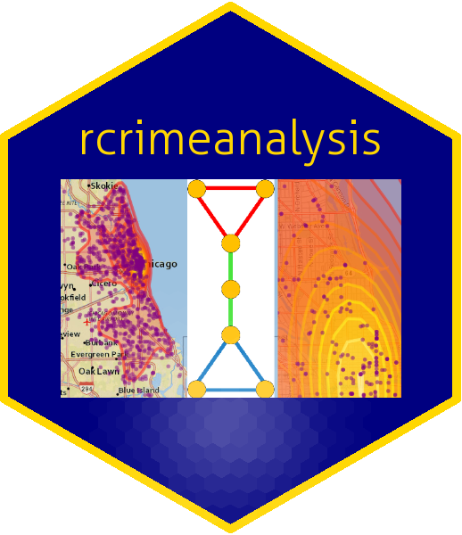

```{r, include = FALSE}
knitr::opts_chunk$set(
  collapse = TRUE,
  comment = "#>"
)

library(rcrimeanalysis)
library(dplyr)
```

The *rcrimeanalysis* package is designed for the analysis of crime incident data from record management systems utilized by policing and security agencies throughout the United States. The package was contributed to provide a robust open source platform with crime analysis functionality since wide variations exist in the techniques that departments use, the levels of sophistication that police managers possess, and the frequency with which agencies engage in crime mapping. 

Crime analysis as an operation involves the following:

* plotting incident locations

* differentiating incidents by crime type and adding topographic information for spatial context

* identification of significant geographic relationships in the occurrence of criminal activity

* discovery of patterns within temporal data of crimes

* understanding crime distributions and their contributing factors

Crime mapping is essentially exploratory data analysis which help to uncover distributions, the distance between observations, and separate small and largescale variation, identify spatial patterns, and generate hypotheses that may explain the observable patterns. Discovered relationships or linkages among crime incidents are the intelligence which facilitates the development of strategies to deal with a given problem, make better decisions, target or effectively deploy resources, formulate resolution of the problem, and sustain efforts to assure continued solution.

This document introduces you to the set of tools in the *rcrimeanalysis* package, and shows you how to apply them to criminal record data. 

## Package Installation <a></a>

* The *rcrimeanalysis* package can be installed from CRAN.

* The development version is also available from the author's GitHub repo. 

Installation is as follows:

```{r setup, eval = FALSE}
# Install from CRAN
install.packages("rcrimeanalysis")
# Install Development Version
devtools::install_github("JSSpaulding/rcrimeanalysis")

# After installation, load and attach the package
library(rcrimeanalysis)
```

## Data: crimes

The *rcrimeanalysis* package contains a sample dataset `crimes` which contains information for 25,000 crime incidents in Chicago, IL from 2017-2019 ^[See the [Chicago Data Portal](https://data.cityofchicago.org/Public-Safety/Crimes-2001-to-present/ijzp-q8t2) for the complete dataset from the Chicago Police Department (2001-present).]. This data was chosen as it is similar in structure to other police record management system (RMS) data in the United States. There are 22 different data elements for each crime incident.

```{r data}
data("crimes")
dim(crimes)
```

## Spatial Functionality

The `geocode_address()` function leverages the utilities of the Google Maps API for the batch geocoding of physical addresses. See the [*ggmap* package](https://github.com/dkahle/ggmap) for instructions on how to register Google Cloud Credentials

```{r eval=FALSE}
library(ggmap)
ggmap::register_google("**CREDENTIALS HERE**")
addresses <- c("The White House, Washington DC", "Capitol Building, Washington DC")
geocode_address(addresses)
```

Geocoding is an essential task in crime analysis/policing and is commonly needed since location data is collected upon report (call for service or statement/affidavit) as an address from the caller or person involved. Once the data is transformed into a geospatial coordinate (latitude, longitude), analysis can take place.

***

The `kde_map()` function performs a key crime analysis task: kernel density estimation for crime heat mapping. The function computes a kernel density estimation of the input crime data and returns an interactive *leaflet* widget of the incidents. The following computes a heat map of narcotics incidents with and without the incidents plotted:

```{r}
narcotics <- subset(crimes, crimes$primary_type == "NARCOTICS")
# Plot without Points
p1 <- narcotics %>% kde_map(pts = FALSE)
# Plot with Incident Points
p2 <- narcotics %>% kde_map()
leafsync::sync(p1,p2)
```

The above maps illustrate hot spots and concentrations of criminal activities by place. The `pts` parameter was included to facilitate the visualization of the data. The population of the pop-up boxes from the data is automated, given that the data is structured as is the example `crimes` data. 

***

The `id_repeat()` function identifies crime incidents which occur at the same location. The identification of repeat crimes can be vital to the linkage of crime incidents and assessment of places. The following code detects 168 repeat crime series. The second detected repeat series is printed which shows that 4 different possession incidents occurred on the same sidewalk throughout 2019. This information could be used to investigate whether this is a location where the narcotics are being dealt, or if there is another rationale for these incidents.

```{r}
narco_repeats <- id_repeat(narcotics)
narco_repeats[2]
```

## Temporal Functionality

The `ts_daily_decomp()` and `ts_month_decomp()` functions perform time series decomposition of crime incident data collected over time for pattern detection. Each function is optimized for a certain frequency interval of data in the time series (daily or monthly). The decomposition functions transform the raw crime data into a time series, perform locally weighted regression for smoothing, and plot the resultant decomposed components of the time series into identified seasonal, trend and irregular components. An example of the `ts_month_decomp()` function is given below for the narcotics crimes:

```{r fig.width=7, fig.height=5}
narco_ts <- ts_month_decomp(narcotics, start = (2017))
plot(narco_ts)
```

The different components can be useful for both the development and evaluation of strategic action. For example, seasonality can be used for administrative planning through personnel and resource allocation. Changepoints in the trend component can be used to identify changes in the crime patterns. For example, if a policy change took place mid 2017, this change may have stimulated narcotics activity or have increased detection and closure rates of narcotics incidents.

***

Crime forecasting is not a technique widely practiced by police agencies to date. The practice of predictive modeling is the process of developing a framework or model which enables the understanding and quantification of the prediction accuracy on future, yet-to-be-seen data. This can be useful in a forward-looking sense to gain an understanding of what future criminal activity could look like. The `ts_forecast()` function uses the crime data to predict the future crime trend and daily frequency with different confidence levels for the next 365 days.

```{r fig.width=7, fig.height=5}
thefts <- subset(crimes, crimes$primary_type == "THEFT")
ts_forecast(thefts, start = c(2017, 1, 1))
```

## Spatio-Temporal Functionality

Traditionally, space and time have been treated as isolated entities in crime analysis. Combination of these data into a spatio-temporal crime analysis workflow can facilitate a more robust analysis because an incident occurs as an interaction between persons or objects within both space and time domains. 

The `kde_int_comp()` function extends the traditional heat map (as seen with `kde_map()`) to perform a comparsion across time intervals. Combining the distribution of incidents with time intervals effectively visualizes the time series data in space, which can be very useful in identifying displacements in criminal activity. The `kde_int_comp()` function was used to evaluate the narcotics incidents from the beginning of 2017 and 2018. Returned is a net difference raster and then 3 *leaflet* (Interval 1, Interval 2, Net Difference) widgets for detailed comparison.

```{r fig.width=7, fig.height=5}
interval <- kde_int_comp(narcotics,
             start1="1/1/2017", 
             end1="3/1/2017", 
             start2="1/1/2018", 
             end2="3/1/2018")
interval
```

\clearpage

***

* The kernel density bandwidth is self calculated so that the levels can be kept consistent. 

* The net difference plot is in terms of levels from the above interval maps. 

* Note the multiple plots are synced such that a translation on one image also occurs on the other images.

* The interval map headers populate based on the user specified intervals.

* Since the purpose of the function is to compare the general trend across intervals, there is no option which can specify the plotting of crime incidents as in the `kde_map()` function.


***

Next, a contemporary method for near repeat analysis is provided. The `near_repeat_analysis()` function searches crime data for spatio-temporal clustering of crime. The function identifies patterns under specified thresholds (distance and time) and determines whether incident **x** is within this distance and time for all other incidents in the dataset. An adjacency matrix method is employed to link these incidents in *igraph* networks. 

```{r fig.width=7, fig.height=5}
crime_samp <- head(crimes, n = 1000)
out <- near_repeat_analysis(data = crime_samp, 
                            tz = "America/Chicago",
                            epsg = "32616")
igraph::plot.igraph(out[[26]])
```

Each vertex of the graph is a crime incident and each edge represents the linkage of these incidents within the specified spatial and temporal parameters. The linkage networks provide potential crime networks discovered under the near repeat premise for intelligence driven police investigation and intervention.

***

If the thresholds for near repeat analysis are unknown to the analyst, the `near_repeat_eval()` function recommends optimal parameters for an area through three dimensional modelling of the spatio-temporal clustering present in the data. The function returns a 2x2 table with the optimal distance and time threshold parameters. This function is computationally intensive, therefore, a progress bar is integrated for the user to track completion percentage.

```{r eval=FALSE}
near_repeat_eval(data = crime_samp, 
                 tz = "America/Chicago",
                 epsg = "32616")
```

***

